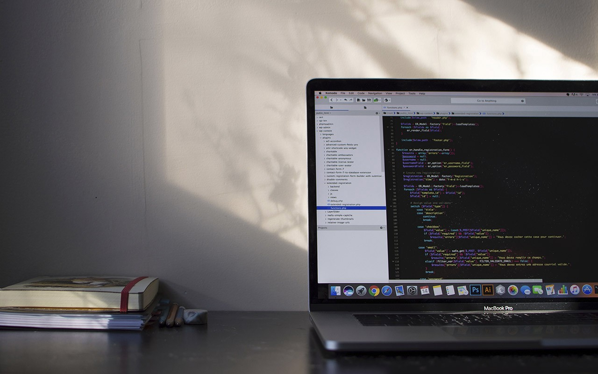
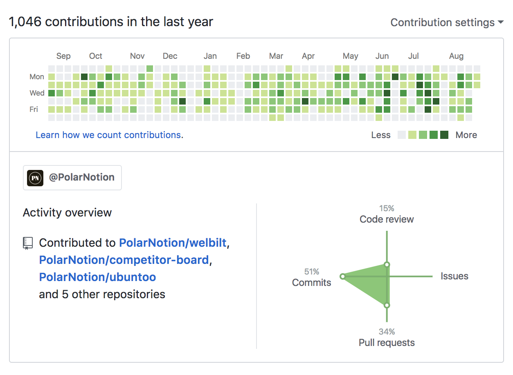

## Recapping a 12 month journey into professional software engineering

It’s been over a year since I’ve started my Apprenticeship at [Polar
Notion](http://www.polarnotion.com/) in May 2017. For people tuning in and
wondering what Polar Notion is, we’re a development and design shop located in
West Midtown Atlanta near Georgia Tech. We build MVPs for either individuals or
small businesses that want to see their idea come to life. We build with those
we enjoy working with. Polar Notion hires developers coming out of college or
bootcamps and builds them up through mentorship and they in return mentor the
next line of apprentices.

Originally when I came on the team as their React Native Apprentice. I’ve had
the best opportunities to not only work on just React Native apps under direct
mentorship but lead my first ReactJs Web App, and work on various Ruby on Rails
projects. In the beginning, I was focused on building out user interfaces,
strategizing how a project should be structured with database architecture,
building out features, and returning to previous projects to scale them. With
each project, I grew more confident from understanding the jargon and finding
the value in pair programming. Since I’ve completed my apprenticeship in May, we
have hired a new set of apprentices in September. I am officially mentoring the
new Ruby Apprentice. We are also in search of a new [Senior Software
Engineer](https://medium.com/polar-notion/senior-software-engineer-72d120a8ec2a)
who can lead the team!

I’ll try not to go into to too much detail with each project but I’d like to
highlight some of my favorite technical parts of some key projects that I felt
were pivotal during my apprenticeship. Projects will be separated by each
framework that were used to build them: React Native, Reactjs, and Ruby on
Rails. Just as there are favorite things, there were also my least favorite
moments in projects that sometimes happen when you’re learning new skills. In
order for me to gain my confidence I had to fail at a lot. I felt very
uncomfortable every step of the way but in a good way. It means I was growing. I
naturally have a “dive into anything” mentality, which at times can be very
beneficial. With lack of planning can be **very disastrous**. It’s cool though,

> I’d rather ask for forgiveness than for permission.

[https://github.com/avaldivi](https://github.com/avaldivi)

### React Native

* Daily Lectio
* Vector Exchange

I was under direct mentorship from Mitch Masia. I initially met Mitch at React
ATL meetup where he gave living coding using Snack building The Not Hotdog app
from Silicon Valley Show. Weeks later he would help me build my first React
Native Applications: Daily Lectio and Vector Exchange.

Daily Lectio is a resource designed to help you read the Bible with the church.
This product was already a web application but to scale it and gain more
traction with interested users, an iOS and Android Application were created so
that users could have their readings right at their fingertips. A Rails API
server and Redux were used to retrieve the daily readings. An npm package was
used to capture and alter styles of every reading to make the text appear just
as they would appear in a Bible. Users have the ability to swipe between each
daily reading going from today’s reading to yesterday’s or tomorrow’s and so
forth. I also learned the deployment process on iOS and Android. They are vastly
different with Android being really easy vs the long process you have to go
through with iOS, using XCode and iTunes Connect.

Vector Exchange was a simulator for cryptocurrency exchange using an API to pull
the latest trends on popular cryptos. A user had ability to create a portfolio
with however much money and buy/trade cryptocurrencies and check market values.
They were able to see their portfolio value in USD or Bitcoin. I learned to use
a FlatList component, Segmented Control on iOS, and the overall importance of
learning to find the right external packages to use that have enough
documentation for reliability and maintenance.

### Reactjs

* KitchenConnect Dashboard

Building a commercial equipment dashboard was by far my most favorite project.
Not only because I lead it but because I was given the opportunity to showcase
what I had been trying to teach myself outside of work. Reactjs and React Native
differ in couple ways but the idea of building components is the same. This
project was mainly focused as a front-end application with static JSON data.
Breaking down common structures and patterns in components to make reusable to
me is pretty interesting and a fun thing to do in my opinion. We used Storybook
to play with a our components and test them before we put them into action. I
learned to deploy the application using a react buildpack with Heroku for the
first time. I struggled adding Sass to the project, because initially I thought
it wasn’t possible with so many trial and error articles until I realized I got
it to work by ejecting the project first which typically isn’t recommended.
Essentially it’s like taking the training wheels off your project and uncovering
everything under the hood for you to change to your liking. Maintaining the
project could be difficult.

In order to build out a wizard to select and deselect different equipment and
update data dynamically we used MobX which is an alternative to Redux for my
object-oriented programming lovers. I come from an object-oriented background
working in Java as my first programming language. Redux is still a bit of
learning curve for me since I’m not use to functional programming…yet.

Using MobX here was also a little difficult for me but I got a lot of help from
my OG mentor John Rae. I may have lead this project but he took it to the finish
line by wrapping entire application in Cordova(PhoneGap) to be downloaded on the
iPad App Store that was later used in a trade show for the client. I am looking
forward to working on my next Reactjs projects and learning from this one.

### Ruby on Rails

* Competitor Board
* Ubuntoo

Competitor Board founded by Heman Patel is a dashboard for Marketers to pull in
their competitor’s social media posts from Twitter, Facebook, Instagram,
LinkedIn and more. The product has a come a long way from only including a few
social platforms to including up to Youtube and other RSS Blog feeds. I was able
to jump on this project with my former mentor Ben as he built the foundation
then gave it to me to style the front-end, work on adding more platforms to pull
data from, and optimize the dashboard for faster load times. In this project I
worked a lot with the HTTParty gem, Twitter API, and Facebook API.

Ubuntoo was my first project working with Daniel McBrayer. He’s quite the human
book of knowledge when it comes to development. Also an advocate for reading
documentation but honestly everyone in this field should be. Ubuntoo is a global
marketplace for environmental and social solutions that connects big
corporations and institutions. They have not launched yet but you can only sign
up if you’re a company making a huge social impact. In this project I was
introduced to AJAX Rails which I found to be very useful in my projects
following this one. This was also a great project on how to implement searching
with querying. It’s actually quite simple and not as complicated as one might
assume. The level of difficulty can increase depending on what queries are
required of course. Up until this project there was a lot front-end stuff I was
doing that I wasn’t doing quite right or could have been more efficient at.
Daniel brought it to my attention that helped me better organize and make use of
Bootstrap.

Overall I’ve worked on more than 12 projects. This is the joy of working for an
agency that builds products for individuals and businesses. You get hands on
learning on not just one big project but multiple ones that can be a pet project
or a full fledged SaaS product. I’ve thoroughly enjoyed every moment and will
continue to do so. Can’t thank [Morgan J.
Lopes](https://medium.com/@MorganJLopes) and Josh Wood enough for creating
opportunities for novice developers and designers to get their start in the
world by giving them the confidence to pursue their true potential.

Thank you again to my project mentors who take time to teach not only me but
other mentees in their lives.

I’m happy to answer any questions anyone might have about my project experience
at Polar Notion. You can also follow me on twitter:
[@driannavaldivia](https://twitter.com/driannavaldivia) 💁

Thanks for reading!

### Orignially Posted on Medium [Polar Notion](https://medium.com/polar-notion?source=footer_card) by [Adrianna Valdivia](https://medium.com/@adrianna.valdivia) 👩🏽‍💻

