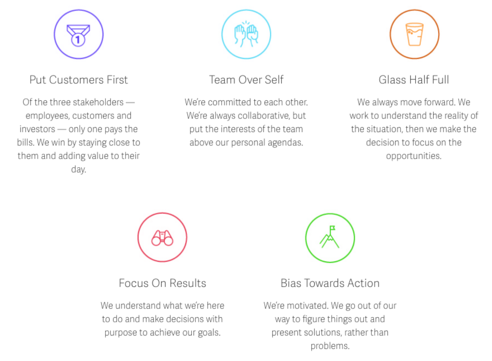

<b>https://unsplash.com/@anniespratt</b>

In January of 2019 I started my position as SalesLoft’s first Junior UI Engineer (UIE). Previously UI Engineers were either hired at mid-level or higher experience levels. If it’s not obvious what UIEs do, I’ll explain. In tech there are a thousand ways to say one thing and everyone has a different definition. Let me tell you SalesLoft’s definition:

### UI Engineers at SalesLoft work as part of cross-functional teams where they help build features for our customers. As part of this role, they are responsible for delivering world-class front end code (primarily React/AngularJS) and advocating for best practices (both SalesLoft specific & industry-wide) to their team.

## Who needs Junior Engineers? 💬

The UI team here at SalesLoft has now grown to 11 team members. There are about 8 teams that own different parts of our front end codebase and each team consists of at least one UIE. So where does that leave the leftovers and myself? We work on the Front End Enablement Team, also called Rhythm and Blues, where we create reusable components for all teams so we don’t have to keep reinventing the wheel. I will talk more about this later, including some of the lessons I have learned from and also areas where I dominated!

The UI Engineering Team is led by Daniel Andrews, the Director of UI Engineering and he oversees the overall front-end team’s output here and helps set the vision for where we’re going as an organization. A few months ago Patrick Hoydar was promoted to an Engineering Manager who manages 5 out of the 12 of us, including me!

Daniel’s reasoning for hiring less experienced talent is:

\*1. A cost-effective way to address technical debt, UI defects, and refactor work.

2. Providing opportunities for mentorship for existing engineers. Having more junior engineers in the building helps us all level up.
3. A Pipeline for talent as our company continues to grow.
4. A more diverse hiring pool.\*

If you’re considering “why would my company want inexperienced developers?” This makes for valid points especially if every developer on your team all look the same which can cause a lack of creativity, stagnation, or faulty hiring practices down the road.

# The Highlights ✨

#### **— SalesLoft Core Values**

<b>https://salesloft.com/company/</b>

I can’t write about my experience working at SalesLoft without speaking on the core values we follow and recognize others for in our [Highest Five](https://medium.com/salesloft-engineering/the-highest-five-promoting-a-culture-of-sharing-recognition-828665c47075) Culture. My favorite one that has allowed me to grow in my team is recognizing situations in a “_Glass Half Full_” perspective. You can very easily become your own worst critic when you set unrealistic expectations for yourself because you compare other people’s path with your own. My team has given me the tools I need in order to measure my new skills with the correct metrics and in return, I provide a way for more experienced engineers to level up. I have such a great team that doesn’t take it all too seriously but reaches goals with strategic planning and open communication for any and all ideas. We look at what didn’t work in our previous sprints and experiment with new processes to see where we can enhance our productivity. When processes do work, we make sure to hold each other accountable without shaming. No one wants to be part of a blame culture.

If you’re a start-up without defined core values, or no one is being held accountable to promote an inclusive culture in an open collaborative company, there is a possibility you are missing out on an opportunity to create momentum to develop your employees and grow as a company. One of my mentors, [Erica Stanley](https://medium.com/u/72f63b292254), wrote an [interesting thought piece](https://medium.com/salesloft-engineering/intentional-culture-a-must-have-for-inclusive-technical-teams-159d8fb03d31) on creating an intentional culture and how your company’s core values can affect how they approach diversity + inclusion. Must read!

#### **— Not just any team: Rhythm and Blues**

My team, Rhythm and Blues, works closely with product designers to create and set a standard of UI components used throughout our products from the SalesLoft app, SalesLoft Chrome Extension used in Salesforce and Gmail, and other internal microservices with a front-end. We maintain and contribute to an internal library called Rhythm while working on large feature requests that contribute to enhancing our front end codebase and platform. We work hard to create a better developer experience from feedback from those who use Rhythm the most.

#### **— My toolkit: React, Storybook, Jest, RTL, Styled Components**

We have a pretty fantastic toolkit and we encourage our engineers to use when they are contributing to Rhythm. In order to test our components visually, we use [Storybook](https://storybook.js.org/) and use [React Testing Library](https://testing-library.com/react) for unit testing. We rely heavily on [Styled Components](https://www.styled-components.com/) when designing and building our components. Although our legacy code is in Angular we work strategically to convert different parts of our app into React. We have recently implemented [Cypress Testing Library](https://www.cypress.io/) in our main application to utilize automated testing in partnership with our QA team. The toolkit we have set up is usually kept up to date, as we are also encouraged to stay up to date with the latest technologies that can help developer productivity. The UIEs hold a [monthly internal meetup](https://medium.com/salesloft-engineering/the-internal-meetup-experiment-72a2d62efb93) called Front End Knowledge Feast where we talk about our latest changes to tools, new processes, new feature changes or updates in Rhythm.

# Lessons Learned & Dominated ✅

#### **— Project: Table Component**

Since starting here I’ve taken on various bugs to work on in order to get accustomed to the application. My main focus this quarter has been moving an inherited table component into our Rhythm library. We used a concise API and refactored the markup into 3 components instead of one.

Our SalesLoft application is table data-driven and this will hopefully be used to refactor future views into React. We’ve learned so much about the different use cases we would need to meet to be truly used over and over again by other teams. There were some challenges how many use cases we want to satisfy with one table, or if in the future we may end up with two types of tables.

#### **— Initiatives: UI Defects, Bi-Weekly Newsletter**

If you work on a product that has legacy code with technical debt lurking around then more than likely there will be bugs. Working on and triaging UI defects is a sure good way to look more into the product that you’re building on. When your team’s focus is to build out new features you should also be mindful of what’s there already. It’s crucial to understand how the application works together with or without external services.

While being on the Rhythm and Blues Team one of the hardest things to get done is making everyone aware of what your purpose is and what you can produce. I started a bi-weekly newsletter that showcases all our newest components that have been contributed by either our team or other UI and Full Stack Engineers. The contributions have allowed engineers to collaborate, learn new tools, and step out of their comfort zones. When it consists of enough _giphys_ you can grab someone’s attention!

#### **— Struggles: Testing**

Learning React Testing Library was a struggle but really interesting to see how flexible it can be if you don’t overthink of what or how to test. The ability to identify what behaviors you are expecting versus what should not occur can be tricky when you are first learning. Also, discovering the [different types of testing](https://dev.to/thejessleigh/different-types-of-testing-explained-1ljo) will be important in your career when working on medium to large codebases. Best practices are to ensure you are testing every piece of code.

#### **— Performance: PR reviews, One on Ones**

Performance in a new role can be measured in multiple ways. The ones I took advantage of the most were Pull Request (PR) reviews and scheduled one on ones with my manager.

PR reviews allow for one or more of your colleagues to see if you are reaching a standard in your code that meets the overall company’s code standards. You can learn a great deal in this process, like understanding the most efficient way to write a piece of code that can make the next time you’re building a feature a lot more productive and even more readable.

[One-on-ones](https://css-tricks.com/the-importance-of-one-on-ones/) are vital to your career if you want a different perspective on how you can learn to grow as a professional. I’ve seen many situations where an engineer may not have weekly contact with their manager and it can very easily go downhill. As an employee, if there is no one to check in with about how everything is going in your role, it can feel like you have been abandoned and the path to developing your career is not clear. As a manager, if you’re not checking in with your employees and scheduling weekly meetings to hear their frustrations or positive reflections then it may seem you’re not really interested in developing a healthy communicative relationship. This should be a meeting where you can be allowed to talk about anything that concerns your career: how to set your quarterly goals, what is blocking you from achieving your goals, what behavioral or technical skills you should work on to develop yourself, or even what you want your career path to look like.

# What’s next?

The end goal for any junior engineer is to move into the next level of experience which can look like a straight line or a zig zag, ultimately you should be finding a way to go forward. As a Junior UIE here at SalesLoft, there’s a self-managed final project you complete with guidance from co-workers that showcases the skills you have acquired that will help you graduate to the next level. This is my current objective. This project requires skills like communication, time management, breaking down work and technical excellence. The hardest caveat of this final project is managing your time wisely between your team’s goals and your individual goals to proceed to the next level. I look forward to writing about my experience with this final project in the near future.

As I gear up for the next level in my career at SalesLoft, we are defining what the path from a Junior UI Engineer to more senior roles looks like. As one UIE levels up, it’s important to pass the torch as a new Junior UIE gets hired. This provides the opportunity for the upcoming mid-level UIE to switch their role to a mentor instead of a mentee. When an engineer finally levels up they can move into roles that require more in-depth technical knowledge or they could move into leading co-workers as an Engineering Manager. No matter what, I believe both roles can develop any person. It is also important to take time to reflect what role you could see yourself in so that you can prepare to evolve when it’s time to get promoted.

Thank you for taking the time to read about my journey. If you have any questions feel free to tweet me [@driannavaldivia](https://twitter.com/driannavaldivia)
