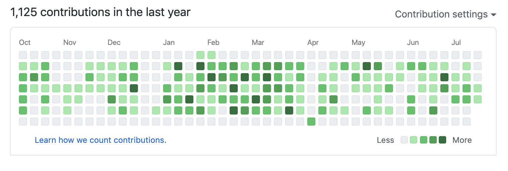

[From Unsplash by Kevin Ku](https://unsplash.com/photos/aiyBwbrWWlo)

It's pretty normal if your work/life balance has been thrown off and I hope you haven't been feeling guilty about it like I have. The world has gone through some pretty eye opening events that are being discussed in the media, social platforms, your job, your family and your friends. It's thrown my life for a loop but not as much as those who's lives have been altered forever. Some of these events have not just occurred but have been brewing for years and now the tea kettle is finally blowing it's steam and unwilling to stop even if you turn off the stove.

I'd never thought I'd be working remotely this early in my career. I remember telling my brother I wouldn't move near my parents which live in a semi-rural area in Georgia, almost an hour away from Atlanta, unless I had a remote job. Never say never right? Working a remote job wasn't ideal for me because I was transitioning from Junior to Mid-level and I didn't want anything to get in the way of that. I absolutely adored the team I was working with as well and I looked forward going to work. You can say work gives me a sense of fullfilment.

Two weeks ago the company I work for announced they would be closing offices for 2020. It was a hard choice on them for sure not ONLY for the safety for their employees but we had just remodeled a floor that we were getting ready to move into right when the pandemic hit. As a company we were excited for it but individually some of us were not ready to hit back the office especially with the uncertainty that lied ahead and poor leadership on the national and local government side. Don't @ me. Along with this shocking news, we are going to be given a \$500 stipend to spend on our home offices. Fortunately I have already invested into standing desk last year and was gifted a monitor last christmas.

But now that working remotely is permanent for the rest of the year that meant I had to clean up my remote work life because I'm telling you, it was a freaking mess.

- I would wake up right when my first meeting would start.
- I would forget to brush my teeth, until I solved something or finished helping someone. (DON'T JUDGE ME)
- I would maybe not even step away from my computer until I actually hit 5pm or 6pm.
- I would not take my hourly lunch or just avoid lunch completely forgetting to eat for the day.

I could share some more but I'd be too embarassed to. These are just some of habits I created while starting to work remotely and I knew I needed boundaries for myself ASAP. Working in these conditions are NOT sustainable. You kind of start to resent yourself and resent your job because _YOU_ aren't setting the boundaries. If you currently work a job that is actually the real culprit of disrupting your work/life balance, I feel for you. I've been there before and it took me a while to actually see it. I would recommend finding another place of work but I know that isn't ideal during a pandemic. My best advice would be to set up the boundaries as best as you can and talk to someone you trust that it's important these boundaries are not crossed or it will affect your productivity levels, negatively.

One of the best ways to RESET your habits is to take the time off and actually learn to separate your home and work life. I found for me it was easier to start a habit when I wasn't expected in a meeting. Since now work and home share the same location, you want to bold the lines at where they stop. Some people have their offices in a different room in the house which can help with bolding that line. Some have a morning routine that gets them started for the day before attending their first meeting. I have a bad habit of checking twitter before stepping out of bed. NOT RECOMMENDED.

The other day I was looking at my github profile. I was admiring something about my commit graph chart. Please do not glorify my chart by the green boxes but actually the empty boxes that surround the green boxes. The border was white, meaning on Saturdays and Sundays, I don't commit diddly squat. It made me realize that the reason I don't commit on Saturdays and Sundays was because I work really hard Monday through Friday to work on my company's objectives, my personal objectives, or learning and leave the weekend to family and personal time. I can bold the lines by days but now I need to bold them by hours on weekdays.

Everyone's situation is different but when it comes to it at the end of the day, we are all humans who need boundaries in all aspects of life. Too much of anything will drain your brain into the abyss quite figuratively. Everyones's work/life balance is different. I'm a single mother who has to balance the needs of my job and child while never forgetting myself. You might be newbie in the tech world, learning how to code while looking for your first gig. You could be an entreprenuer creating your first start up while working a full-time job or not. In those situations, add children or dependents on your list and you've got more on your plate. Don't wait until it goes all wrong before you start to proritize yourself.

## Here are my tips!

Take what works, leave the rest alone.

1. Have a separate workspace in your home
2. Create a morning routine
3. Set up "Do Not Disturb" schedule on your device
4. Add working hours to your slack profile
5. Take your lunch during your work day
6. Control your social media consumption of bad news
7. Take time off if you can
8. Create your good habits during your "stay-cation"
9. Have a friend to keep you accountable about taking care of yourself
10. Communicate with your team about your childrens' schedule (if applicable)

Do you have anymore tips that helps you balance your work and home life? Please share!
_Happy SELF-CARE Day!_

### Follow me on [Twitter](https://twitter.com/driannavaldivia) 👩🏽‍💻
