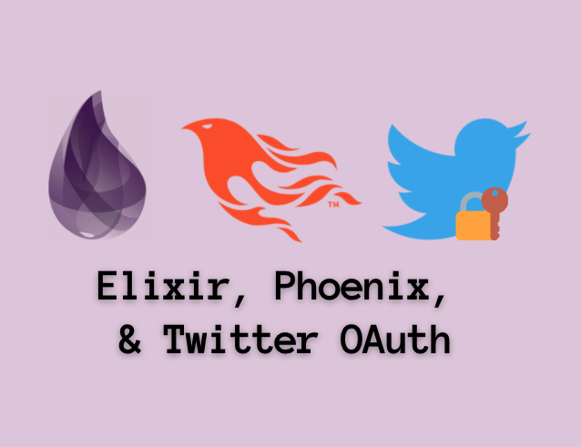

As a way for me to understand Elixir more I like to start projects where I can get used to the syntax by building on an API, like Twitter. Phoenix is the web framework we'll use to develop our application. This tutorial is just right for the person who has some development experience and wants to get a feel for what Elixir and Phoenix are about. At the end of this we will be able to do the following:

- Authenticate, log in with our Twitter account, and log out
- Create and send a tweet to our timeline
- See a list if our most recent tweets

I hope to take this project a bit further in the future past these basic actions but anyone would be able to do that by the end of this tutorial.

## What this tutorial will not have:

- LiveView
- Ecto to connect to a data store
- Setting up user authentication away from Twitter like using your own email and password

Why not? I really want to focus on what Elixir itself offers and how Phoenix works before you need to start making updates to a database.

## What this tutorial does have:

- Using ExTwitter to use Twitter OAuth 1.0a and Twitter API v1.1
- Erlang/Elixir installation
- Phoenix project set up
- Plugs, Controllers, and Routes
- Views and Templates

### Twitter Developer Account

1. Apply for access here:

    [https://developer.twitter.com/en/apply-for-access](https://developer.twitter.com/en/apply-for-access)

2. Once you have access, go to Developer Portal
3. Add an app to to the project area
4. Add these callback urls:

    ```
    http://localhost:4000
    http://localhost:4000/auth/callback
    http://localhost:4000/auth/request
    ```

5. You'll need your consumer tokens when we finally set up the project (#5 in '*Create a new project*')

### How to install Erlang and Elixir

I highly recommend using `asdf` to have the ability to install and manage different versions of Elixir and Erlang. Alternatively, you can install Elixir without using asdf by going to the 2nd option.

1.  [Install with Elixir and Erlang with asdf](https://developer.twitter.com/en/docs/twitter-api/v1)
2. [Other options of installing Elixir and Erlang](https://elixir-lang.org/install.html)

### Create a new project

In the terminal and in the directory where you want your project to live we will start with these set of commands and configure the Extwitter hex package:

1. `mix phx.new appname`
    - command creates a new phoenix project
    - say *yes* to installing and fetching dependencies
2. `cd appname`
3. `mix ecto.create`
    - although we will not be using the database, we still need to create one in order to run the project in the next step
    - at the beginning of project you can also add the flag `-- no-ecto` to avoid creating Ecto files
4. `mix phx.server`
    - In order to stop the server you can `CTRL+C` and abort

5. Let's add the dependencies we'll use not already included in the project  in `mix.exs`. We'll add these 4 hex packages and run `mix deps.get` in the terminal to update our project. This equivelant to how we add packages in a node project and run npm install:

```bash
defp deps do
  [
		#.....
    {:plug_cowboy, "~> 2.0"},
    {:oauther, "~> 1.1"},
    {:extwitter, "~> 0.12"},
    {:timex, "~> 3.6"}
  ]
end
```

  6. Create an `.env`  in your root directory for your keys. Run `source .env` in your terminal once you have added your keys:

  ```bash
  export TWITTER_CONSUMER_KEY="YOUR CONSUMER KEY HERE"
  export TWITTER_CONSUMER_SECRET="YOUR CONSUMER SECRET HERE"
  ```

  7. Configure Twitter API with the `ExTwitter` hex package in `config.ex`

  ```elixir
  config :extwitter, :oauth, [
    consumer_key: System.get_env("TWITTER_CONSUMER_KEY"),
    consumer_secret: System.get_env("TWITTER_CONSUMER_SECRET")
  ]
  ```

### Plugs

Plugs are basically the foundational layer of Phoenix's Components; Controllers, Endpoints, and Router. It is the core of Phoenix's HTTP Layer. We can create our own Plugs with modules (or even functions) that process and accept a connection, and add it to the Router's browser pipeline. A pipeline is just a list of plugs and the browser pipeline is specifically used to prepare the routes to render the requests for the browser.

In the root directory of your `/app_web` , we will create a `plugs.ex` file and add 3 of the following modules in the same file:

  <details>
    <summary>AssignCurrentUser</summary>

  ```elixir
  defmodule AppWeb.Plugs.AssignCurrentUser do
    import Plug.Conn

    def init(opts) do; opts; end;
    def call(conn, _opts) do
      assign(conn, :current_user, get_session(conn, :current_user))
    end
  end
  ```

  When you create a custom plug module, you are required to import `Plug.Conn` and define two functions: `init` and `call`

  - `init` allows to initialize arguements or options to be passed into `call` function
  - `call` is where transformation happens for the connection we retrieve. In our custom case we pass 3 arguments  into the `assign` function. The first argument is required to be the connection, the third is a new key we are adding to the connection struct, and the third is the value. The value that is added is the information of the user from the current session.

  </details>

<details>
  <summary>RequireUser</summary>

Another custom plug created, simply follows the same rules when creating one. In out `init` function we check if a key value `current_user` exists in the connection, thus allowing the page to retrieve the connection information to passed down in the controllers. If it does not, we send a 401 response.

This will not be used in `Router.ex` but it will be used in the TweetController to determine if a user can send a tweet.

```elixir
defmodule AppWeb.Plugs.RequireUser do
import Plug.Conn

  def init(opts) do; opts; end;
  def call(conn, _opts) do
    if conn.assigns.current_user do
      conn
    else
      conn
      |> Plug.Conn.send_resp(401, "")
      |> halt()
    end
  end
end
```
</details>


<details>
  <summary>ConfigureTwitterClient</summary>

Our 3rd module plug in the this file will allow to us maintain and save our Twitter user's secret tokens after they have made a successful authentication using *ExTwitter*. We will be able to pass this information down to our controllers later in this tutorial that require it to have access to user's account information within the session.

```elixir
defmodule AppWeb.Plugs.ConfigureTwitterClient do
  import Plug.Conn

  def init(opts) do; opts; end;
  def call(conn, _opts) do
    if conn.assigns.current_user &&
      get_session(conn, :access_token) &&
      get_session(conn, :access_token_secret) do
        # Configure extwitter credentials
        ExTwitter.configure(
          :process,
          Enum.concat(
            ExTwitter.Config.get_tuples,
            [ access_token: get_session(conn, :access_token),
              access_token_secret: get_session(conn, :access_token_secret)]
          )
        )
    end
    conn
  end
end
```
</details>

We're going to add two of our plugs to the pipeline browser in your `router.ex` file.
<details>
  <summary>Router</summary>

We add our custom plugs at the end because our plugs are dependent on the "session" information that is applied in the connection. You can see `plug :fetch_session` is second in the pipeline.

```elixir
defmodule AppWeb.Router do
  use AppWeb, :router
  alias AppWeb.Plugs

  pipeline :browser do
    plug :accepts, ["html"]
    plug :fetch_session
    plug :fetch_flash
    plug :protect_from_forgery
    plug :put_secure_browser_headers
    plug Plugs.AssignCurrentUser
    plug Plugs.ConfigureTwitterClient
    end
  
  #....
end
```

Phoenix will invoke each plug in order as the browser hits each scoped path and will start capturing the information we need to render our page.

</details>

### Controllers

In `/app_web/controllers/` we will edit an existing file `page_contoller.ex` and create `auth_controller.ex` and `tweet_controller.ex` 

<details>
  <summary>AuthController</summary>

The auth_controller will handle how we request a twitter user's secret tokens, add it to our configuration, verify authentication, and redirect back the user to the homepage.

```elixir
defmodule AppWeb.AuthController do
  use AppwWeb, :controller

  alias AppWeb.Router
  
  # ......
end
```

In order to initialize a controller we need to defined its use. We will also need the router in this controller in order to retrieve and redirect paths.

```elixir
def request(conn, _params) do
  token = ExTwitter.request_token(
    Router.Helpers.auth_url(conn, :callback)
  )
  {:ok, authenticate_url} = ExTwitter.authenticate_url(token.oauth_token)
  redirect conn, external: authenticate_url
end
```

We use *ExTwitter* to help us request and use the callback path to allow us to retrieve a token provided by the Twitter Authentication process, to lead us to an authentication url, also provided by Twitter API.

```elixir
def callback(conn, %{"oauth_token" => oauth_token, "oauth_verifier" => oauth_verifier}) do
  {:ok, access_token} = ExTwitter.access_token(oauth_verifier, oauth_token)

  # if we just ran configure without merging in the existing
  # config, we would lose existing config
  ExTwitter.configure(
    :process,
    Enum.concat(
      ExTwitter.Config.get_tuples,
      [ access_token: access_token.oauth_token,
        access_token_secret: access_token.oauth_token_secret ]
    )
  )

  user_info = ExTwitter.verify_credentials()
  user_obj = %{ name: user_info.name, screen_name: user_info.screen_name }

  conn = conn
    |> put_session(:current_user, user_obj)
    |> put_session(:access_token, access_token.oauth_token)
    |> put_session(:access_token_secret, access_token.oauth_token_secret)

  redirect conn, to: Router.Helpers.page_path(conn, :index)
end
```

Remember the *ExTwitter* configuration for our secret tokens we did earlier when setting up our project? In the callback we retrieve the secret tokens for the user and `Enum.concat` in order to merge the values instead of overriding our app's tokens.

We also verify the credentials and if all is well, we are able to get the user's information. 
For now we only get the `name` and `screen_name` and it constructs a map. 
We put all these important details into the session to be retrieved in our custom made plugs.

So what happens when this doesn't go all too well and it fails because maybe the user forgot their password?

```elixir
def callback(conn, %{"denied" => _}) do
  conn
  |> put_flash(:error, "You did not give us access to your account")
  |> redirect(to: Router.Helpers.page_path(conn, :index))
end
```

We add another function with the same name AND same amount of arguments . 
This is a form of pattern matching. One of the really cool features about Elixir I enjoy.

```elixir
def logout(conn, _params) do
  conn
  |> configure_session(drop: true)
  |> redirect(to: Router.Helpers.page_path(conn, :index))
end
```

This is the last method we want to add to our auth_controller. It's going to allow the ability for for the user to logout and scrape their Twitter information from the session and redirect them back to the homepage.

</details>

<details>
  <summary>PageController</summary>

In your controller directory there should be an existing `page_controller.ex` that handles rendering your homepage.

```elixir
defmodule AppWeb.PageController do
  use AppWeb, :controller

  def index(conn, _params) do
    render(conn, "index.html")
  end
end
```

Instead of rendering `index.html` we are going to render two different templates based on if a current_user exists on our connection.

```elixir
def index(conn, _params) do
  if conn.assigns.current_user do
    screen_name = conn.assigns.current_user.screen_name
    tweets = ExTwitter.user_timeline([
        screen_name: screen_name,
        exclude_replies: true,
        include_rts: false,
        count: 1
      ])
    render conn, "logged_in.html", %{tweets: tweets}
  else
    render conn, "logged_out.html"
  end
end
```

If a `current_user` exists on the connection then we will want to pull the following user information from it in order to get our first pieces of the Twitter account. In our case the `user_timeline`.  If there is no `current_user`, the user will see the `logged_out.html` template.

We'll create these templates in the Templates and Views section.
</details>

<details>
  <summary>TweetController</summary>

We will create one last controller to have the ability to tweet from our app.

```elixir
defmodule AppWeb.TweetController do
  use AppWeb, :controller
  plug AppWeb.Plugs.RequireUser
  plug :put_layout, false

  alias EyefollowWeb.Router

  def create(conn, %{"message" => message}) do
    tweet = ExTwitter.update(message)
    url = "https://twitter.com/#{tweet.user.screen_name}/status/#{tweet.id}"

    conn
    |> put_flash(:info, "Tweet created! See #{url}")
    |> redirect(to: Router.Helpers.page_path(conn, :index))
  end
end
```
</details>

<details>
  <summary>Router</summary>

After creating and editing our controllers, we will head back to the `router.ex` file and add new paths that correspond to each controller and methods we created.

```elixir
scope "/", AppWeb do
  pipe_through :browser

  get "/", PageController, :index
  get "/auth/request", AuthController, :request
  get "/auth/callback", AuthController, :callback
  get "/auth/logout", AuthController, :logout

  resources "/tweets", TweetController, only: [:create]
end
```

We need to provide a path for each level of authentication created in `auth_controller.ex` as **get** requests Since we are creating new sub-path called `/auth` we will have to create a view for it. We will get to that in Templates and Views.

You'll also see we've created path for tweets but have set `only: [:create]` in order to indicate that this resource should only have one action. We'll create a view for this too in the next section.

Also if you run `mix phx.routes` in your terminal, you will be able to see the routes created here. It will look something like this for the first few routes we've created.

```elixir
page_path  GET   /                        AppWeb.PageController :index
auth_path  GET   /auth/request            AppWeb.AuthController :request
auth_path  GET   /auth/callback           AppWeb.AuthController :callback
auth_path  GET   /auth/logout             AppWeb.AuthController :logout
tweet_path  POST  /tweets                 AppWeb.TweetController :create
```
</details>

### Templates and Views

We are almost to the end of the finish line. We are going into the `/app_web/templates/` directory to create and edit a few templates then move to views to initialize paths. 

<details>
  <summary>Layout</summary>

We're going to edit the layout that wraps around templates used in `page_controller.ex`

`/layout/app.html.eex`

```html
<div class="container">
  <p class="alert alert-info" role="alert"><%= get_flash(@conn, :info) %></p>
  <p class="alert alert-danger" role="alert"><%= get_flash(@conn, :error) %></p>

  <main role="main">
    <div class="row">
      <div class="col-lg-12">
        <h1>Twitter &amp; OAuth in Elixir</h1>
      </div>
    </div>

    <div class="row">
      <div class="col-lg-12">
        <%= @inner_content %>
      </div>
    </div>
  </main>
</div>
```

We're going to replace everything after the closing `</header>` but still remain inside the `<body></body>` HTML tags.
</details>

<details>
  <summary>Logged In</summary>

In the page directory we'll rename the `index.html.eex` to `logged_in.html.eex` and replace the content with the following:

```html
<h2>
  Welcome, <strong><%= @current_user.name %></strong>!
  <a href="<%= Routes.auth_path(@conn, :logout) %>" class="btn btn-default btn-sm">Logout</a>
</h2>

<form class='form-inline' method='post' action='<%= Routes.tweet_path(@conn, :create)%>'>
  <input type="hidden" name="_csrf_token" id="csrf_token" value="<%= get_csrf_token() %>">
  
  <div class="form-group">
    <input type="text" name="message" placeholder="Tweet message..." maxlength=140/>
    <button type="submit" class="btn btn-default btn-sm" id='tweet-form-submit'>Tweet</button>
  </div>
</form>

<h3>@<%= @current_user.screen_name %>'s tweets</h3>

<div class="tweets-container">
  <%= for tweet <- @tweets do %>
    <div class="tweet-card">
      <%= tweet.created_at%>
      <%= tweet.text%>
    </div>
  <% end %>
</div>
```

NOTE: Out of the box, we do not automatically get access to use `get_csrf_token` when we use a form with a post method to create a tweet. In our `app_web.ex` file in the `view` method, we must add `get_csrf_token: 0` as part of the list of convenient functions to be used in any controller.
</details>

<details>
  <summary>Logged Out</summary>

  ```html
  <p>
    You are not logged in.
    <a href="<%= Routes.auth_path(@conn, :request) %>" class="btn btn-default btn-sm">Sign In</a>
  </p>
  ```
</details>

In the `/views` directory, we will add two new views that will allows us to render the templates we have created and access paths we added in `Router.ex`.

<details>
  <summary>Auth View</summary>

`auth_view.ex`

```elixir
defmodule AppWeb.AuthView do
  use AppWeb, :view
end
```
</details>

<details>
  <summary>Tweet View</summary>

`tweet_view.ex`

```elixir
defmodule AppWeb.TweetView do
  use AppWeb, :view
end
```
</details>

### Resources

- The original tutorial was provided by [Steve Klabanoff](http://headynation.com/twitter-oauth-elixir-phoenix/). There a couple things I decided to do differently that were outdated based on the latest version of `Elixir ~1.7` and `Phoenix ~1.5.4`

- [ExTwitter Hex Package](https://hexdocs.pm/extwitter/ExTwitter.html) Documentation

- [Twitter OAuth 1.0a](https://developer.twitter.com/en/docs/authentication/api-reference) Documentation and [Twitter API v1.1](https://developer.twitter.com/en/docs/twitter-api/v1) Documentation

- Documentation on how [Phoenix](https://hexdocs.pm/phoenix/plug.html#content) works from Plugs, Routing, Controllers and more.

- What is [Pattern Matching](https://elixirschool.com/en/lessons/basics/functions/#pattern-matching)?

- [Collections](https://elixirschool.com/en/lessons/basics/collections/): What are Lists, Maps, and Tuples ?

### [Share tutorial on Twitter](http://twitter.com/share?text=Intro to Elixir and Phoenix using Twitter OAuth by @driannavaldivia&url=http://adrianna.dev/posts/elixir-phoenix-and-twitter-oauth&hashtags=myelixirstatus) 👩🏽‍💻

