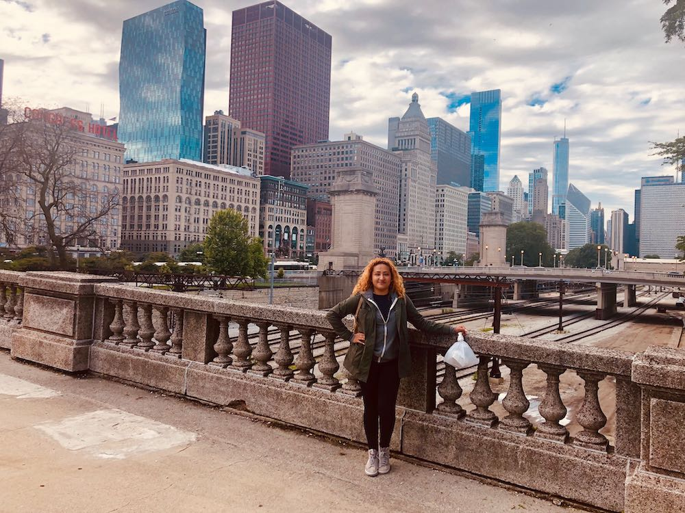

Here's a little history and current stuff I'm doing now.

Adrianna is a _UI Engineer_ at SalesLoft, Atlanta's #1 Best Place to Work, has previously worked at at an agency building various web and mobile apps in React, React Native, and Ruby on Rails and interned at MailChimp as first role full-time role while in college. Adrianna attended Georgia Gwinnett College in Lawrenceville, GA attaining a Bachelor's of Science in Information Technology with a focus of Software Development. While in college Adrianna and two other women founded the first Women in Technology Student Organization winning grants from NCWiT.

After college Adrianna became part of the Women Who Code Atlanta Leadership team as an _Evangelist_. She is a public speaker that shares her knowledge on leadership, career, and different React related technologies. Outside of her professional and volunteer work in the Atlanta tech community, Adrianna loves to discuss astrology, mental wellness, and music specifically Hip Hop. Adrianna is also a mommy to a 7 year old boy who you might get to know in zoom meetings. If you have questions about direction in your career or want to get to know me better professionally, check my [Calendly](https://calendly.com/adrianna-valdivia/30min) to schedule time! Follow me on Twitter if you're okay with getting to know me better as a human, not only as a coder 😃 

## Here's my toolkit experience:
1. React Hooks
2. React Context API
3. React Router
3. Styled Components
4. React Testing Library
5. React Final Form
